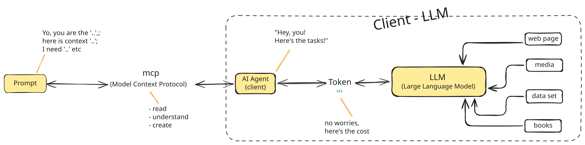

AI is a powerful tool that can assist me while I am working on the project. The questions are, am I using it correctly? and do I even know how it works? and the answer is -- NO, I don't know and I use it wrong too.

As a UI designer, I learn that I cannot just go and type on ChatGPT "Hey, I need to design a magic website". THERE ARE PROCESS!! Here's how it work!

Here's what I learn, the main factor for include;

**Prompt:** Think of the prompt as the Project Brief. It provides the constraints, the goal, and the persona. A good prompt include input of goal, task and output format.
**MCP(Model Context Protocol):** MCP acts as a *Universal Adapter*. It allows the AI to "read", "understand" and "create" data from different sources.
**AI agent:** While the LLM is the "brain," the Agent is the Manager who knows how to use that brain. It takes your prompt and decides on a plan. It sits between you and the raw model, handling the "Hey! Yo! Here's the tasks!".
**Token:** This can be costly, so mindful of what you are prompting. It acts as a fuel to get information from LLM by break down the text into small chunks as every words you are prompting consume the tokens.
**LLM (Large Language Model):** This act as a brains where store data, which come from data set, web page, medias, and books. It is a prediction engine. Based on all the data it has seen, it predicts what the next token should be.

# WORK WITH AI

>
> Model is impacted by how we Prompted or Interacted with the model
>

### PROMPT STRUCTURE

**FEED INFORMATION WELL** and ensure that you work with AI as **Collaborator** rather than Instructor by applying these 3 rules when prompting:

**Define:** give AI a "ROLE"
**Context:** You are essentially building a brief for the AI to follow:
- **Information:** The *What* (e.g., "I am building a parking application for urban commuters.")
- **Rule:** The *Constraints* (e.g., "Must use a high-contrast dark mode; must follow Material Design 3 guidelines.")
- **Actionable:** The *Process* (e.g., "First, list the primary user flows. Second, suggest a 5-color palette. Third, write the Tailwind CSS classes.")
- **Expected output:** The *Deliverable* (e.g., "A Markdown table," "A code block for an Astro component," or "A bulleted list.")

**Adjusting point:** tells the AI exactly what to "look at" in its own draft to make it better e.g. hierarchy, reducing noise, or creating spacing.

>
> As I mentioned that **TOKEN** is expensive. You need to be clear, specific and precise. These applies in all situations e.g. writing the prompt, designing, and coding. This is ensure that you get the best outcome and it is the most effective why to work with AI as they are consuming the correct information.
>
> Be messy, AI will produce your work Poorly, *"then how do we write it properly?"*
>

### WRITING PROMPT

You need to **AVOID**;

**Verbose instruction:**  invent, tell you prefer X over Y.
**Unnecessary element:** DO NOT write a large MD file and didactic explanation.
**Long list:** DO NOT repeat the word and long list as it may corrupt information.
**Duplicate:** DO NOT copy-paste information as it could create the fiction and miscommunication or misled the task.

---

###### Note:

> Asking **WHY?** in every design decision.

When we work with AI, having a crystal-clear goal makes everything easier. It might feel like it takes more time at the beginning, but it’s the best way to:

- Reduce risks and silly mistakes.
- Clear up misunderstandings before they happen.
- Avoid the "slow down" that happens in later stages when things aren't planned well.

It is essential to stay disciplined with the technical side while designing. I need to keep these points front-of-mind:

- **Layer Organization:** Don't let the layers get messy; keep them logical.

- **Hierarchy:** Always have a clear visual "order" for the eye to follow.

- **Consistent Naming:** If I don't name things correctly, I'll lose track (and so will the AI).

- **Reusable Components:** Stop reinventing the wheel—build once, use many times.

- **Flex & Grid Layouts:** Design with a "code-first" mindset using modern layout logic.

- **Library Knowledge:** Always ask the AI to "learn" from the existing library/documentation.

