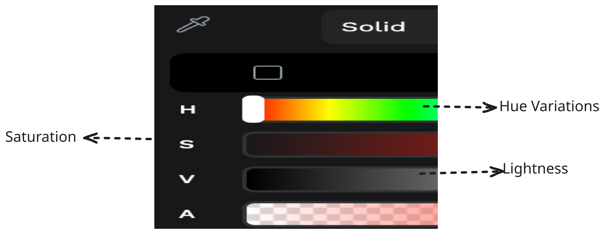
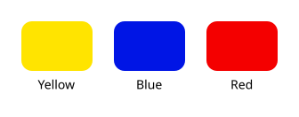
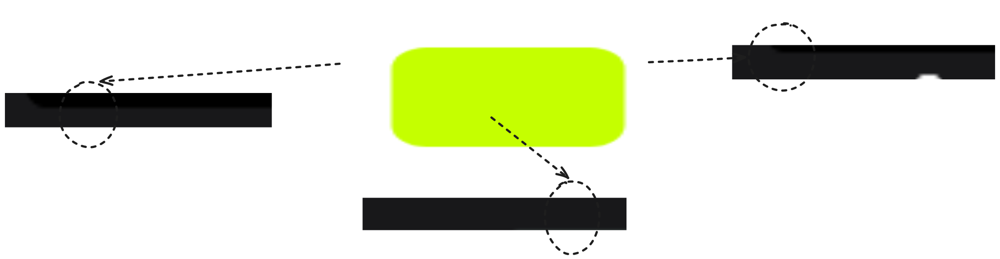
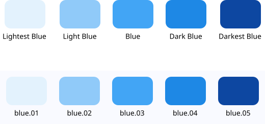
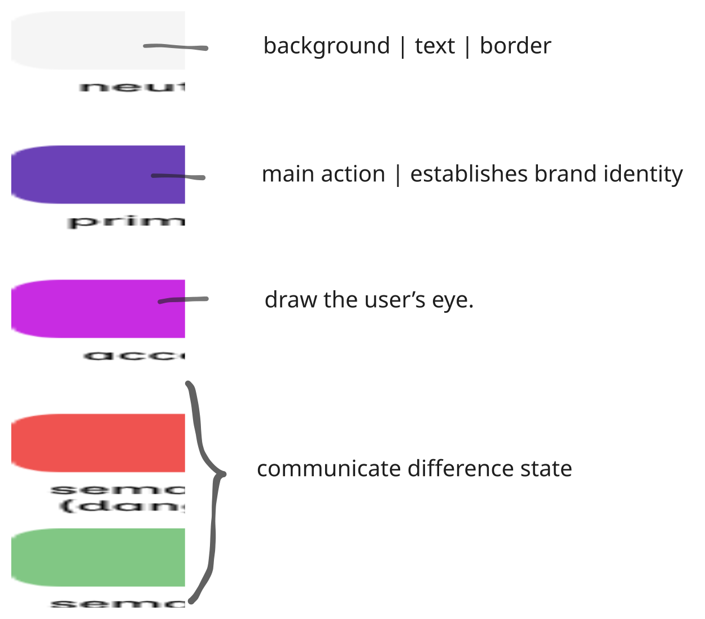
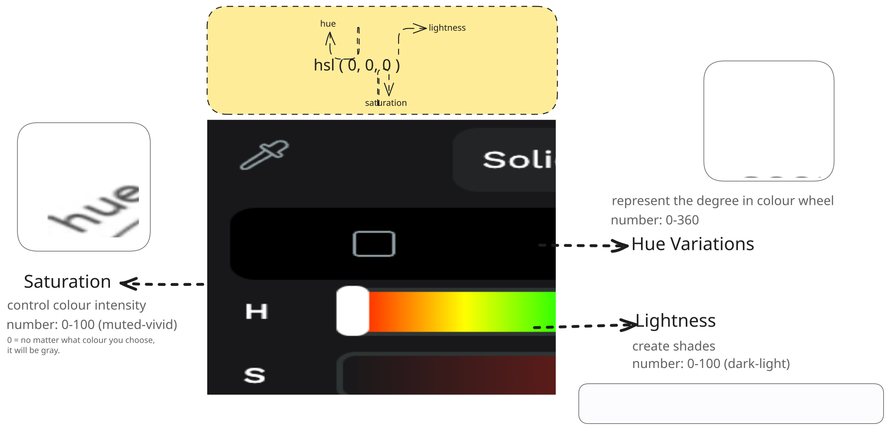
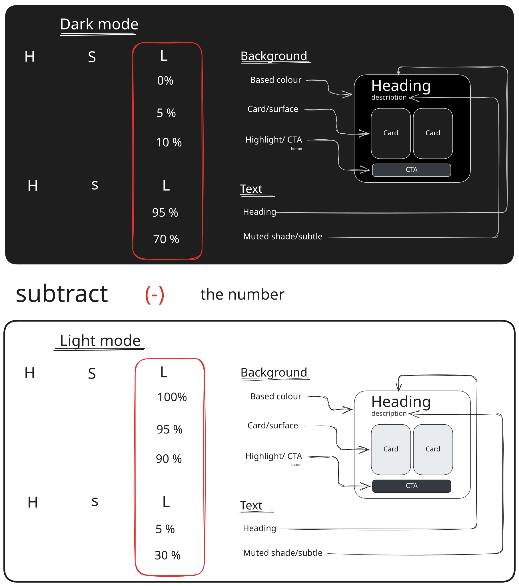

# 1. Name Colour

Managing colors and giving them logical names is essential in UI design to create a "shared language" between designers and developers. Below are the points in consider:

**Consistency of the name:** Use the `same naming rules` for all colors in your palette. This makes colors easier to find and use.

**Shared Language:** `Consistent naming` prevents confusion during `design discussions` and handovers to developers.

**Predictability:** A clear system (like "Purple Pink") helps everyone understand exactly what a color looks like without seeing it.

**Scalability:** Moving from descriptive names to a `numbered ramp` (e.g., 100-900) is better for large projects with many color variations.


On the right-hand side of the working space, you will see the colour tool:



### 1.1 Keep the Name Simple 🎨

Use `concise names`. For instance, if you have just one shade of blue, red, and yellow.



### 1.2 Naming Hue Variations 🎨

When you have shades that fall between primary colors, use a two-part naming convention:

The second part is the main color (e.g., Yellow).

The first part is the closest neighboring color (e.g., Green).

Example: "Yellow Green"



### 1.3 Naming Lightness and Saturation 🎨

Lightness: Use terms like "Light," "Lighter," "Lightest," "Dark," "Darker," or "Darkest." or use numbers (e.g. blue 10, blue 20).



### 1.4 Naming Saturation 🎨

Use descriptive terms like "Muted," "Vivid.


### 1.5 Naming The "Off" Concept 🎨
For colors that aren't quite pure, use the term "Off":

Off-Black: A black that is slightly lighter.

Off-White: A white with a slight tint of another color.


---

# 2.Pick UI Colour

Now that I learn about naming colour without making other people confuse. It's also important to know how to work with them.

**STOP** playing with colour. Instead, pick something that **MATTER** such as *neutral, primary, accent, semantic* then you just playing with lightness and shade.



---


# 3. Create Shade

To create shade you will need to pick the right colour format:

- HEX(Hexadecimal)
- RGB(Red, Green, Blue)
- CMYK(Cyan, Magenta, Yellow, Black)
- HSL (Hue, Saturation, Lightness)
- OKLAH(Modern CSS Standard)

> HEX and RGB is worst when creating colours palette, let me introduce you **HSL**




Let's doing in practice! 

## Lightness

As the colour you could choose the colour base on your likeliness. So I will start with building card and shadow.

As the image below:

I will set the H (Hue) and S (Saturation) at 0%. By locking those two values, I only have to play with the Lightness (L). This creates a predictable, consistent range of grays that feels clean and balanced.

The main use cases for adjusting the lightness are the Background and Text, because this allows you to create a strong visual hierarchy using color.



```
THIS IS JUST AN EXAMPLE OF HOW YOU INSTRUCT THE ROOT
#### Dark Mode
--bg-dark: hsl(336 0% 1%);
--bg: hsl(300 0% 4%);
--bg-light: hsl(0 0% 9%);
--text: hsl(300 0% 95%);
--text-muted: hsl(300 0% 69%);
--highlight: hsl(330 0% 39%);
--border: hsl(0 0% 28%);
--border-muted: hsl(300 0% 18%);
--primary: hsl(262 59% 77%);
--secondary: hsl(76 35% 59%);
--danger: hsl(9 26% 64%);
--warning: hsl(52 19% 57%);
--success: hsl(146 17% 59%);
--info: hsl(217 28% 65%);

#### Light Mode
```css
--bg-dark: hsl(0 0% 90%);
--bg: hsl(300 0% 95%);
--bg-light: hsl(300 50% 100%);
--text: hsl(300 0% 4%);
--text-muted: hsl(0 0% 28%);
--highlight: hsl(300 50% 100%);
--border: hsl(NaN 0% 50%);
--border-muted: hsl(340 0% 62%);
--primary: hsl(265 35% 34%);
--secondary: hsl(71 100% 14%);
--danger: hsl(9 21% 41%);
--warning: hsl(52 23% 34%);
--success: hsl(147 19% 36%);
--info: hsl(217 22% 41%);
```

## Shadow

To make a card or surface look realistic and elevated, you need to combine **four core elements**:
- Border
- Gradient
- Shadow
- Highlight

Instead of just slapping a lazy drop-shadow on your card, follow this professional order of operations:

**The Subtle Gradient:** Apply a very soft vertical gradient (from top to bottom) to the card's background. In nature, light comes from above, so the top of your card should be slightly lighter than the bottom.

**The Double Border (The Highlight Trick):** Give your card a thin 1px border. Use a light color on the top border to act as a highlight, and a slightly darker gray on the bottom border to anchor it.

**The "Lighter & Longer" Shadow:** To make a shadow look truly realistic, avoid small, dark, blurry smudges. Instead, make the shadow lighter (lower the opacity) and longer (increase the blur radius and the vertical Y-offset). This simulates a soft, natural ambient light.

Here's the example that I made 🎨


